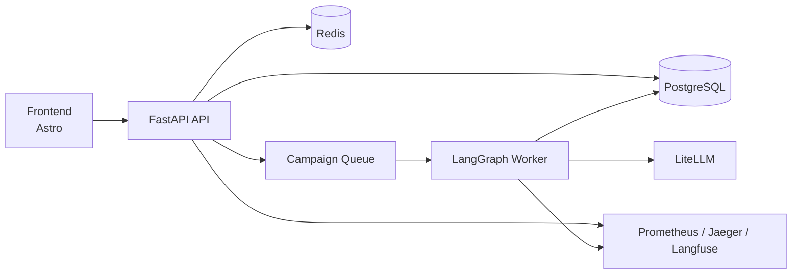

# OmniBrand Studio

OmniBrand Studio is a multi-tenant agentic content platform for generating,
scoring, reviewing, and publishing brand-compliant campaigns across channels
and locales. The stack combines FastAPI, LangGraph, PostgreSQL, Redis,
LiteLLM, and a separate Astro frontend, with observability built in.

## What This Repository Contains

- A FastAPI API for campaign intake, review, publishing, auth, and admin flows
- A LangGraph worker pipeline for agent orchestration and scoring
- A PostgreSQL and Redis-backed runtime for state, queues, and attribution
- A local observability stack with Grafana, Prometheus, Jaeger, and Langfuse
- A separate Astro frontend for the studio UI

## Quick Start

### First-time setup

```bash
make fresh-start
make smoke
make urls
```

### Restart an existing local instance

```bash
make restart
make urls
```

### Local development modes

```bash
make dev         # backend only: api + worker
make frontend    # frontend only
make dev-full    # backend + frontend together
```

## Common Commands

| Command | Purpose |
| --- | --- |
| `make fresh-start` | Install dependencies, generate JWT keys, and start the Docker stack |
| `make restart` | Stop and restart the Docker stack without wiping volumes |
| `make smoke` | Run the end-to-end acceptance check |
| `make test` | Run the backend test suite |
| `make lint` | Run Ruff and mypy |
| `make logs` | Tail API and worker logs |
| `make urls` | Print local URLs and credentials |
| `make down` | Stop containers and keep data |
| `make down-reset` | Stop containers and remove Docker volumes |

## Architecture At A Glance



## Repository Map

| Area | Purpose | Guide |
| --- | --- | --- |
| `backend/` | API, worker, pipeline, services, tests | [backend/README.md](backend/README.md) |
| `frontend/` | Astro studio frontend | [frontend/readme.md](frontend/readme.md) |
| `infra/` | Compose-time infra, LiteLLM, Grafana, Prometheus, nginx | [infra/README.md](infra/README.md) |
| `docs/` | Internal reference material, runbooks, observability notes, architecture notes | Internal only |

## Recommended Reading Paths

### For reviewers

1. `make fresh-start`
2. `make smoke`
3. `make urls`

### For backend contributors

1. [backend/README.md](backend/README.md)

### For frontend contributors

1. [frontend/readme.md](frontend/readme.md)
2. `make frontend`

## Notes

- Use `uv` for Python dependency and command execution. Do not use `pip` or `poetry` here.
- Use Docker for the full local stack. `make up` and `make restart` are the standard entry points.
- After schema-affecting changes, keep migrations and seed data current before validating runtime behavior.

