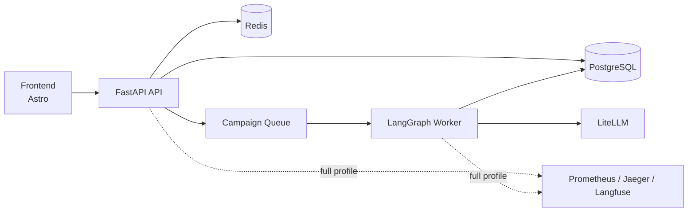

# OmniBrand Studio

**OmniBrand Studio** is an open-source, agentic content localization platform. A LangGraph pipeline generates brand-compliant content across 6 channels and 2+ locales, driven by a FastAPI backend, a real-time React frontend, and a suite of AI judges.

> **Full setup guide → [`docs/setup.md`](docs/setup.md)**

## What This Repository Contains

- A FastAPI API for campaign intake, review, publishing, auth, and admin flows
- A LangGraph worker pipeline for agent orchestration and scoring
- A PostgreSQL and Redis-backed runtime for state, queues, and attribution
- An opt-in local observability stack with Grafana, Prometheus, Jaeger, and Langfuse
- A separate Astro frontend for the studio UI

---

## Architecture Overview

```
┌─────────────────────────────────────────────────────────────┐
│  Frontend  (Astro + React + Tailwind)   :4321 (dev)         │
│  Campaign Copilot UI — WebSocket chat + SSE pipeline events  │
└──────────────────────────┬──────────────────────────────────┘
                           │ HTTP / WS / SSE
┌──────────────────────────▼──────────────────────────────────┐
│  FastAPI (api)  :8000                                        │
│  REST API · /auth · /campaigns · /conversations · /reviews   │
│  /knowledge · /users · /orgs · Prometheus /metrics           │
├──────────────────────────────────────────────────────────────┤
│  Worker                                                      │
│  Redis BLPOP consumer → LangGraph pipeline                   │
│  Prometheus metrics on :9091                                 │
└──┬──────────┬───────────┬───────────┬────────────────────────┘
   │          │           │           │
┌──▼──┐  ┌───▼──┐  ┌─────▼──┐  ┌────▼───────┐
│ PG  │  │Redis │  │ MinIO  │  │  ChromaDB  │
│:5432│  │:6379 │  │ :9000  │  │ (local FS) │
└─────┘  └──────┘  └────────┘  └────────────┘
┌─────────────────────────────────────────────────────────────┐
│  LiteLLM Proxy  :4000  →  Anthropic / OpenAI / Groq         │
│  Langfuse       :3001  →  LLM trace visibility              │
└─────────────────────────────────────────────────────────────┘
┌─────────────────────────────────────────────────────────────┐
│  Prometheus :9090 · Grafana :3000 · Jaeger :16686           │
│  MailHog :8025 · MinIO Console :9001                        │
└─────────────────────────────────────────────────────────────┘
```

---

## LangGraph Pipeline

Each campaign runs through this pipeline:

```
intake_agent
  → content_generator
  → personalization_agent
  → translation_agent
  → judge_gate
  → judge_claude ┐
  → judge_gpt4o  ├── (parallel fan-out)
  → judge_llama  ┘
  → confidence_aggregator
  → reflexion
  → review_gate         ← interrupt point (human review)
  → publishing_agent    → MailHog (demo email delivery)
```

---

## Stack

| Layer | Technology |
|---|---|
| Backend | FastAPI, Python 3.12, uv, asyncpg, SQLAlchemy async |
| Pipeline | LangGraph, LangGraph Checkpoint Postgres |
| LLM Gateway | LiteLLM proxy (Anthropic / OpenAI / Groq) |
| Queue | Redis BLPOP (`campaigns:queue`) |
| Database | PostgreSQL 16 |
| Vector Store | ChromaDB (local) or Pinecone (managed) |
| Object Storage | MinIO (S3-compatible) |
| Auth | RS256 JWT + API key (`X-API-Key`) |
| Observability | Prometheus, Grafana, Jaeger (OTLP), Langfuse |
| Frontend | Astro + React + Tailwind CSS v4 |

---

## Quick Start

### First-time setup

```bash
# Create and fill in .env (see docs/setup.md for all variables)
cp .env.example .env

# Install dependencies, generate JWT keys, and start the Docker stack
make fresh-start
make smoke
make urls
```

### Restart an existing local instance

```bash
make restart
make urls
```

### Local development modes

```bash
make dev         # backend only: API + worker
make frontend    # frontend only
make dev-full    # backend + frontend together
```

For the full setup guide including all environment variables, API keys, and configuration options, see **[`docs/setup.md`](docs/setup.md)**.

### Common commands

| Command | Purpose |
|---|---|
| `make fresh-start` | Install dependencies, generate JWT keys, and start the Docker stack |
| `make restart` | Stop and restart the Docker stack without wiping volumes |
| `make up` | Start the lightweight six-service application stack |
| `make up-full` | Add observability dashboards/tracing and MinIO |
| `make smoke` | Run the lightweight end-to-end acceptance check |
| `make smoke-full` | Validate the full observability stack and application flow |
| `make test` | Run the backend test suite |
| `make lint` | Run Ruff and mypy |
| `make logs` | Tail API and worker logs |
| `make urls` | Print local URLs and credentials |
| `make down` | Stop containers and keep data |
| `make down-reset` | Stop containers and remove Docker volumes |

## Architecture At A Glance



## Repository Map
---

## Observability

| Service | URL | Purpose |
|---|---|---|
| API | http://localhost:8000/docs | REST API + Swagger UI |
| Frontend | http://localhost:4321 | Campaign Copilot UI |
| Grafana | http://localhost:3000 | Dashboards (Campaign Ops, LLM Quality, Infra, KPIs) |
| Prometheus | http://localhost:9090 | Metrics |
| Jaeger | http://localhost:16686 | Distributed traces |
| Langfuse | http://localhost:3001 | LLM traces |
| MailHog | http://localhost:8025 | Email delivery sink |
| MinIO Console | http://localhost:9001 | Object storage |

---

## Documentation

### Repository Map

| Area | Purpose | Guide |
|---|---|---|
| `backend/` | API, worker, pipeline, services, tests | [`backend/README.md`](backend/README.md) |
| `frontend/` | Astro studio frontend | [`frontend/readme.md`](frontend/readme.md) |
| `infra/` | Compose-time infrastructure, LiteLLM, Grafana, Prometheus, nginx | [`infra/README.md`](infra/README.md) |
| `docs/` | Internal references, runbooks, observability, and architecture notes | See the guides below |

| Doc | Contents |
|---|---|
| [`docs/setup.md`](docs/setup.md) | One-time setup, configuration reference, run instructions |
| [`docs/run-and-operations-guide.md`](docs/run-and-operations-guide.md) | E2E run paths, pipeline stages, RAG ingestion, testing |
| [`docs/review-gate-testing-guide.md`](docs/review-gate-testing-guide.md) | Human review gate setup and end-to-end testing |
| [`docs/local-eval-developer-guide.md`](docs/local-eval-developer-guide.md) | No-Docker local eval mode |
| [`docs/intake_agent.md`](docs/intake_agent.md) | Intake agent design |
| [`docs/publish_agent.md`](docs/publish_agent.md) | Publishing agent + email template design |
| [`CLAUDE.md`](CLAUDE.md) | Agent coding guide, invariants, model aliases |

### Working Notes

- Use `uv` for Python dependencies and command execution; do not use `pip` or Poetry.
- `make up` is the default lightweight stack. Use `make up-full` only when
  dashboards, tracing, Langfuse, or MinIO are needed.
- Hosted RAG embeddings require the provider key configured for LiteLLM's
  `embedding` alias. Without it, retrieval uses a logged degraded hash mode.
- After schema-affecting changes, keep migrations and seed data current before validating runtime behavior.

