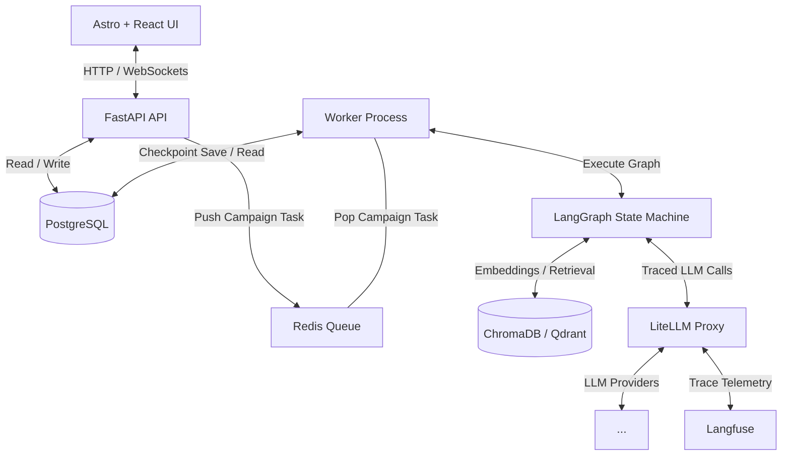
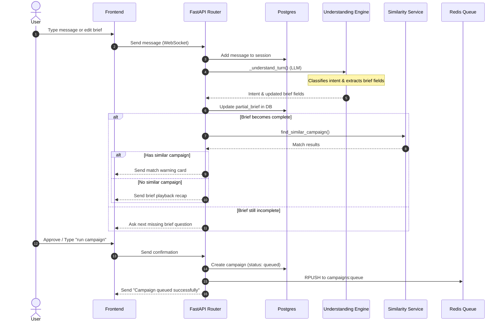
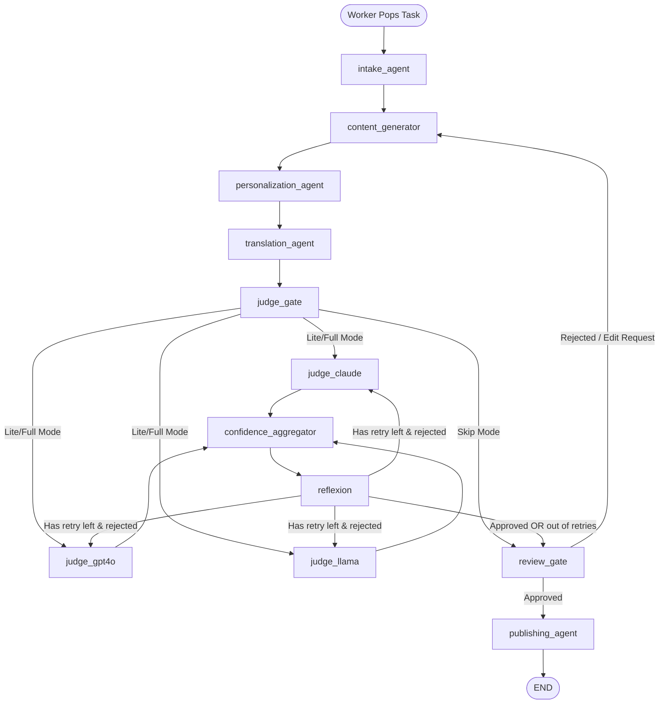
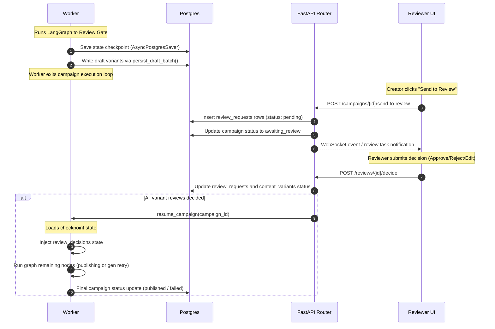

# OmniBrand Studio — System Flow & Architecture Understanding

This document outlines the core system architecture, data models, runtime processes, and LangGraph multi-agent pipeline of OmniBrand Studio. 

---

## 1. System Topology & Architecture

OmniBrand Studio is split into a frontend UI (Astro + React), a synchronous API layer (FastAPI), an asynchronous processing worker (running LangGraph), and multiple backing services orchestrated via Docker Compose.

### Components:
1. **Frontend (Astro + React):** Implements a Single Page App dashboard (`App.jsx`) managing three main views: `ConversationView` (Co-pilot chat), `CampaignsGalleryView` (campaign list and details), and `AdminView` (RAG guidelines upload).
2. **API (FastAPI):** Hosts endpoints for auth, campaigns, reviews, notifications, and handles active WebSockets for conversational brief intake.
3. **Queue (Redis):** Manages task distribution via `campaigns:queue` and a dead-letter queue `campaigns:dead_letter`.
4. **Worker (Python `worker.main`):** Consumes tasks from Redis via `BLPOP` and executes the campaign generation LangGraph.
5. **Relational Database (PostgreSQL):** Stores business state and serves as the LangGraph state checkpointer (`AsyncPostgresSaver`).
6. **LLM Router (LiteLLM):** Acts as a gateway translating model aliases to actual API calls (supporting caching and daily budget constraints).
7. **Trace Observability (Langfuse):** Tracks all LLM calls in-flight using spans and runs latency/cost attribution.

---

## 2. Interactive Intake & Chat Lifecycle

Before a campaign is run, the user collaborates with the **Campaign Copilot** to construct a brief.

### Key Logic:
- **`understanding_engine`:** Uses LLMs to parse free-text inputs, extract structured parameters into a `PartialBrief`, and classify user intents (e.g., `check_status`, `submit_campaign`, `explain_progress`).
- **`brief_collector`:** Uses regex and heuristic rules as a fallback structure to extract fields when LLMs fail.
- **Playback & Similarity Check:** Once all required fields (Objective, Channels, Locales, Audience Segments, Target Audience, and Token Budget) are extracted, a similarity service checks if a duplicate campaign has already been run. If so, a warning is shown. If not, the user is prompted to type a confirmation.
- **Enqueuing:** Upon confirmation, the campaign status transitions to `queued`, and a payload is pushed to the Redis `campaigns:queue`.

---

## 3. LangGraph Generation & Evaluation Pipeline

The background worker pops the campaign from Redis and invokes the LangGraph state machine (`backend/pipeline/graph.py`).

### State Machine Phases:
1. **`intake_agent`:** Normalizes locales/channels, queries brand guidelines from RAG to populate `rag_context`, and maps objectives into standard `GenerationTask`s.
2. **`content_generator`:** Generates master drafts in **English** for each channel × segment.
3. **`personalization_agent`:** Infuses target audience characteristics into the master English copy.
4. **`translation_agent`:** Translates the personalized English drafts into target locales (supporting primary, fallback, and validation translation paths).
5. **`judge_gate`:** Determines the judge panel configuration (`skip`, `lite`, `full`).
6. **Judges (`judge_claude`, `judge_gpt4o`, `judge_llama`):** Rate each variant against 6 rubric criteria: tone, vocabulary, channel formatting, CTA style, cultural appropriateness, and factual grounding.
7. **`confidence_aggregator`:** Fans in scores, computes weighted means/variances, and determines routing decisions (`auto_approve`, `flag`, `auto_reject`).
8. **`reflexion`:** Corrects failing variants using judge critique details (up to 1 retry round).
9. **`review_gate`:** A LangGraph interrupt point. The graph pauses and yields control back to the database saver.
10. **`publishing_agent` (MailHog):** Runs after human approval to output published copy.

---

## 4. Human Review & Checkpoint Resumption Flow

Because LangGraph supports checkpoint persistence, the pipeline pauses at `review_gate` by configuring `interrupt_before=["review_gate"]`.

---

## 5. Relational Database Mapping

PostgreSQL acts as the core transactional repository. Below is the mapping of main tables:

- **`campaigns`:** Stores overall campaign metadata (brief, target channels/locales/segments, budget, current status).
- **`content_variants`:** Stores output copy per channel × segment × locale. Status can be `pending`, `draft`, `approved`, `rejected`, `edited`, or fail states.
- **`brand_scores`:** Tracks the evaluation of every judge model (Claude, GPT, Llama) for every variant round (linked to `content_variants.id`).
- **`aggregated_scores`:** Holds the consolidated statistics (weighted mean, consensus level, routing decision) derived by the aggregator.
- **`review_requests`:** Tracks pending and completed human reviews.
- **`audit_log`:** Range-partitioned immutable audit ledger tracking user and service actions.

---

## 6. Open Tasks Mapping & Blast Radius

Based on our architecture scan, here is where each open item resides:

- **Item 24 (Chat socket streaming):** Resides in `api/routers/conversations.py::_process_turn`. Needs analysis of client-server WebSocket packet exchanges.
- **Item 22 + Channel Entitlements:** Touches `pipeline/agents/intake.py` (adding LLM validation of brief objective against brand config) and `pipeline/agents/prompts/channel_prompts.py` (checking channel availability).
- **Reflexion Locale Isolation:** Touches `pipeline/agents/reflexion.py`. The node should only regenerate the master English variant (which lives on `variants`) and let the graph step backwards through `translation_agent` for child locales, rather than rewriting translated content directly.
- **`traced_llm_call` silent fallback:** Touches `pipeline/agents/base.py`. Needs proper retry decorators and strict error logging rather than returning dummy formatted strings.
